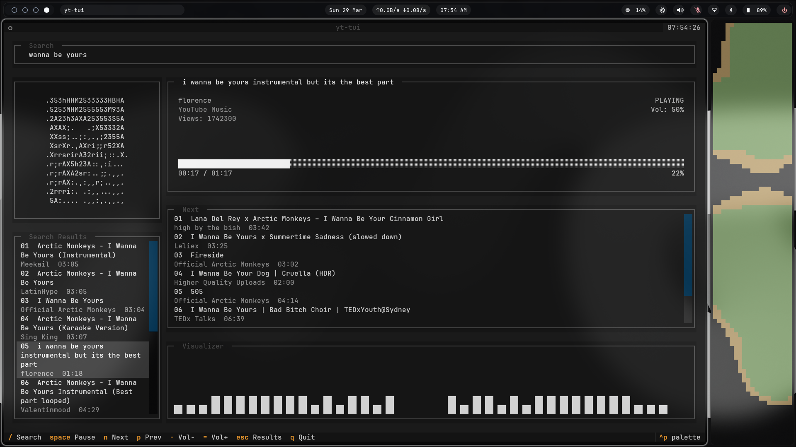

# yt-tui

Grayscale terminal YouTube music player. Built with Textual, `yt-dlp`, `mpv`, and Pillow.

A real TUI — not a prompt-based CLI and not a GUI wrapper. Keyboard-driven search, audio-only playback, ASCII thumbnail art, up-next flow, and an embedded visualizer.



## Features

- Full-screen Textual interface
- In-app YouTube search via `yt-dlp` (appends "music" to queries)
- Audio-only playback through `mpv` with IPC socket control
- ASCII thumbnail art for the current track
- Single `Next` list — no separate recommendations and queue
- Automatic next-track handoff when playback ends
- Lightweight preload of the top `Next` item before the current song ends
- Embedded grayscale `cava`-style visualizer
- Complete keyboard-first controls

## Requirements

System packages:

- `python3` 3.12+
- `yt-dlp`
- `mpv`
- `cava`

Python dependencies (installed automatically):

- `textual >= 0.81.0`
- `pillow >= 10.0.0`

## Install

**Editable pip install** (recommended):

```bash
git clone https://github.com/yourusername/yt-tui.git
cd yt-tui
python3 -m pip install --user -e .
```

Launch with:

```bash
yt-tui
```

Or use the launcher script directly:

```bash
./yt-tui
```

## Controls

| Key         | Action                     |
|-------------|----------------------------|
| `/`         | Focus search bar           |
| `Esc`       | Focus results list         |
| `Enter`     | Play selected track        |
| `Space`     | Pause / Resume             |
| `n`         | Play next                  |
| `p`         | Play previous from history |
| `←` / `→`   | Seek 10 seconds            |
| `-` / `=`   | Volume down / up           |
| `q` / `Ctrl+C` | Quit                   |

## Behavior

- Tracks only load when you explicitly select one. Highlighting in search results or `Next` does not prefetch metadata, thumbnails, or audio URLs.
- The `Next` list is derived from the currently playing track using search heuristics. Recommendation quality is still rough — karaoke, slowed, or reverb variants may show up.
- The visualizer uses `cava` and prefers the current PulseAudio sink monitor source.
- Everything is intentionally grayscale and terminal-native.

## Project Structure

```
src/yttui/
├── __main__.py   # Entry point
└── app.py        # All app logic: search, playback, mpv IPC,
                  # next-track generation, UI layout, styling,
                  # and embedded visualizer rendering
```

## Development

The project currently keeps most logic in `src/yttui/app.py`. The plan is to break it into modules as things stabilize.
